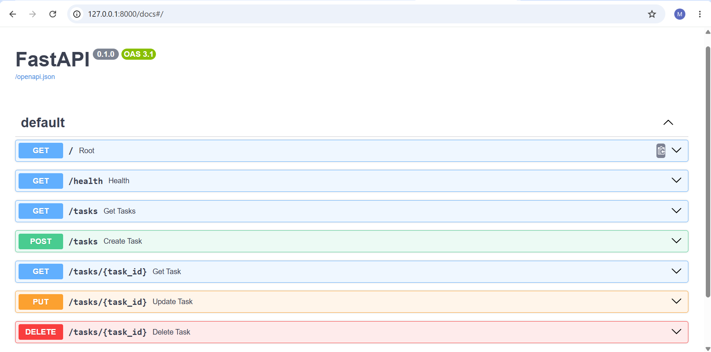
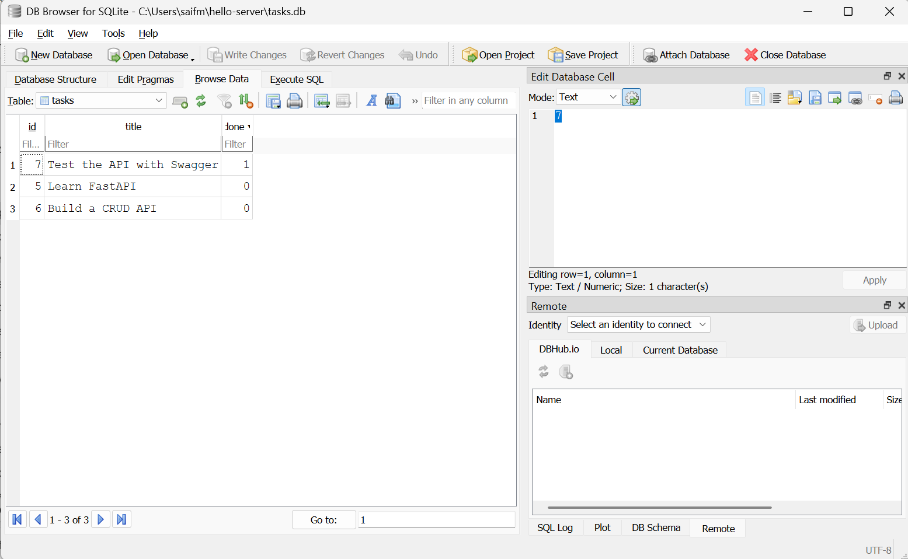

## Assignment 2 — SQLite
# Task API

A simple CRUD API built with Python and FastAPI.

The API supports creating, reading, updating, and deleting tasks. Originally built with in-memory
storage (Assignment 1); as of Assignment 2, tasks are stored in a SQLite database so data survives
a server restart.

Each task contains:

- `id` — unique task ID
- `title` — task title
- `done` — completion status

## Why SQLite?

SQLite was chosen because it needs no separate server or installation — the whole database is a
single file (`tasks.db`) that lives next to the code. That makes it ideal for a project this size:
zero setup, and data now survives a restart because it's written to disk instead of held in memory.

`tasks.db` is created automatically the first time the app runs, along with the `tasks` table and
three seeded example tasks. The database file is git-ignored, so every fresh clone starts clean.

## Requirements

- Python 3.10+
- FastAPI
- Uvicorn

## Installation and Running

Clone the repository:

```bash
git clone https://github.com/saif098-bit/Assignment-1-api
cd hello-server
```

Create and activate a virtual environment:

```bash
python -m venv venv
venv\Scripts\Activate.ps1
```

Install dependencies:

```bash
pip install fastapi uvicorn
```

Start the server:

```bash
uvicorn main:app --reload
```

The API will be available at `http://127.0.0.1:8000`, and `tasks.db` will be created automatically
with three example tasks seeded in.

## Swagger UI

The API provides interactive documentation using Swagger UI.



## Database



## Stage 4 — Exploring SQLite by hand

I opened `tasks.db` in DB Browser for SQLite and ran several queries directly against the database.

Example query: `UPDATE tasks SET done = 1;` followed by `DELETE FROM tasks WHERE done = 1;`
This marked every task as done, then deleted every task — clearing the table completely. Calling
`GET /tasks` immediately afterward (no server restart) returned `[]`, proving my API and DB Browser
read the exact same file with no syncing involved. Restarting the server then reseeded the table,
confirming the seed logic only runs when the table is truly empty.

## Assignment 3 — Containerize your stack
## Stage 0 — Postgres in Docker

Started a Postgres 16 container (16 used instead of latest/18, since 18 changed its
default data directory layout):

\`\`\`bash
docker run --name taskdb -e POSTGRES_PASSWORD=dev -e POSTGRES_DB=tasks -p 5432:5432 -v taskdata:/var/lib/postgresql/data -d postgres:16
\`\`\`